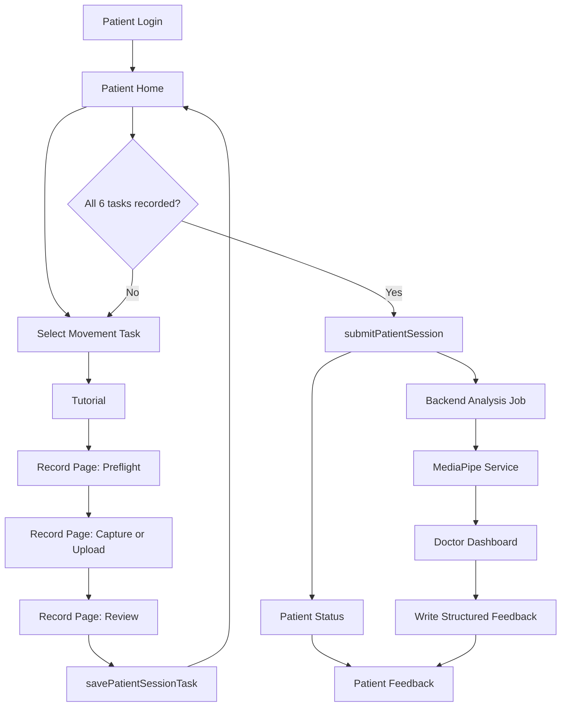

# Movement Analysis Subsystem: Project Flow For AI

## Project Summary

This project is a frontend prototype for a home-based markerless movement analysis and tele-rehabilitation workflow.

The main idea is:

1. A doctor creates and assigns a recording session for a patient.
2. A patient records or uploads movement videos from home for that assigned session.
3. The system stores each movement task in the assigned assessment session.
4. After all required tasks are completed, the patient submits the session.
5. The system shows a mock processing flow for pose extraction and screening.
6. A doctor reviews movement quality, risk flags, event markers, charts, and writes feedback.
7. The patient reads the doctor feedback and exercise plan.

The active patient, doctor, and admin flows are wired to the FastAPI backend in `backend/`, with MongoDB metadata storage and MediaPipe service integration for analysis. The backend is moving from demo-only collections toward DB-backed `users`, `tasks`, `sessions.sessionTasks`, `uploads.uploadId`, and `sessions.analysis`. Some legacy prototype screens still use older mock data.

## Tech Stack

- Vite
- React 18
- TypeScript
- React Router
- TanStack Query
- Tailwind CSS
- Recharts
- Lucide React icons

## Current Runtime Shape

The app starts from `src/main.tsx`, wraps the app with `AppProviders`, then renders routes from `src/app/router.tsx`.

Main routes:

| Route | Purpose |
| --- | --- |
| `/` | Simple role selection landing page |
| `/auth/login?type=patient` | Patient login |
| `/auth/login?type=doctor` | Doctor login |
| `/patient` | Patient home and current doctor-assigned active session |
| `/patient/tutorial` | Tutorial before recording a movement task |
| `/patient/record` | Camera setup, recording/upload, review, symptom report, save task |
| `/patient/status` | Session processing and review status |
| `/patient/feedback` | Patient-facing doctor feedback |
| `/doctor` | Doctor review dashboard and Add Session flow |
| `/admin/login` | Admin password login |
| `/admin/dashboard` | Admin users, videos, feedback, and payload console |

The `src/features/analysis` and `src/features/dashboard` folders contain older or standalone analysis UI code, but they are not currently connected in `src/app/router.tsx`.

## Main Concepts

### Patient

The prototype uses one demo patient:

```text
PATIENT-7712
```

Defined in:

```text
src/features/patient/data/patient.mock.ts
```

### Assessment Session

A patient session contains assigned lower-limb ROM movement tasks. In v1 the doctor Add Session form defaults to all 6 lower-limb ROM tasks, and the doctor can uncheck tasks before creation. A session starts as `assigned`, becomes `draft` after partial recording, and becomes `ready_to_submit` after every assigned task is recorded.

Session statuses:

| Status | Meaning |
| --- | --- |
| `assigned` | Doctor created the session and patient has not recorded any task yet |
| `draft` | Some tasks are not finished yet |
| `ready_to_submit` | All 6 tasks are recorded |
| `queued_analysis` | Submitted and waiting for analysis |
| `processing_analysis` | MediaPipe analysis is running |
| `pending_doctor_review` | Analysis completed and waiting for doctor review |
| `feedback_ready` | Doctor feedback is available |

### Movement Tasks

Defined in:

```text
src/features/patient/data/movementTasks.ts
```

Current active tasks:

| Task ID | Display Name | Purpose |
| --- | --- | --- |
| `hip_flexion` | Hip Flexion | Seated trunk-to-thigh ROM check |
| `hip_extension` | Hip Extension | Prone straight-leg thigh-rise ROM check |
| `knee_flexion` | Knee Flexion | Seated edge thigh-to-shank flexion check |
| `knee_extension` | Knee Extension | Seated edge return-to-straight knee check |
| `ankle_dorsiflexion` | Ankle Dorsiflexion | Seated heel-down shank-to-foot angle check |
| `ankle_plantarflexion` | Ankle Plantarflexion | Seated toe-point shank-to-foot angle check |

Each task includes:

- label and short label
- required camera view
- camera distance instruction
- recording duration
- tutorial title/body
- optional safety note
- symptom questions for relevant body parts

## Patient Flow

### 1. Login

File:

```text
src/app/AuthLoginPage.tsx
```

The shared login page reads `type=patient` or `type=doctor` from the query string. Patient login calls `mockLogin()` from `patientApi.ts`; doctor login uses the demo doctor login helper. On success, patient users navigate to:

```text
/patient
```

Doctor users navigate to `/doctor`.

### 2. Patient Home

File:

```text
src/features/patient/pages/PatientHomePage.tsx
```

The home page loads:

- current active assigned session
- latest submitted session
- latest doctor feedback

Mock API functions:

```text
getPatientDraftSession() // calls /patient/sessions/active
getLatestPatientSession()
getLatestDoctorFeedback()
```

The page shows only the tasks from the active session assigned by the doctor. If there is no active session, it shows an empty state saying there is no doctor-assigned session yet. Selecting a task navigates with both movement type and session task identity:

```text
/patient/tutorial?task=<task_id>&sessionTaskId=<session_task_id>
```

When all 6 tasks are recorded, the submit button becomes enabled. Pressing it calls:

```text
submitPatientSession()
```

Then the user is sent to:

```text
/patient/status
```

### 3. Tutorial

File:

```text
src/features/patient/pages/PatientTutorialPage.tsx
```

The tutorial page reads the selected task from the `task` query parameter.

Example:

```text
/patient/tutorial?task=hip_flexion
```

It displays the tutorial text and task-specific camera instructions. The page simulates watching a tutorial video by enabling the next button after a short delay.

Next route:

```text
/patient/record?task=<task_id>
```

### 4. Record / Upload

File:

```text
src/features/patient/pages/PatientRecordPage.tsx
```

This is the most important patient workflow. It has 3 phases:

| Phase | Purpose |
| --- | --- |
| `preflight` | Open camera preview and confirm setup checklist |
| `capture` | Countdown, record webcam video, auto-stop after task duration |
| `review` | Preview video, upload/replace file, fill symptoms, save task |

#### Preflight Phase

The patient confirms:

- A4 reference is visible
- full body is visible
- camera distance is correct
- lighting is good
- safety note is accepted, if the task has one

The app tries to open the webcam with:

```text
navigator.mediaDevices.getUserMedia()
```

If the browser cannot open or record webcam video, the app moves to review mode and asks the user to upload a video instead.

#### Capture Phase

The page uses:

```text
MediaRecorder
```

It performs a countdown, records the video, auto-stops after `task.durationSeconds`, converts the recorded blob to a `File`, and moves to review.

#### Review Phase

The patient can:

- preview the recorded/uploaded video
- upload or replace a `.mp4`, `.mov`, or `.webm` file
- see video quality checks based on the preflight checklist
- answer symptom questions per body part
- add notes
- save this movement task into the draft session

Saving calls:

```text
savePatientSessionTask()
```

After saving, TanStack Query invalidates the draft session query and navigates back to:

```text
/patient
```

### 5. Submit Session

File:

```text
src/features/patient/api/patientApi.ts
```

When all 6 tasks are recorded, `submitPatientSession()` changes the draft into a submitted session with status:

```text
queued_analysis
```

The backend then starts per-session analysis work and moves the session through analysis and doctor-review statuses.

### 6. Status Page

File:

```text
src/features/patient/pages/PatientStatusPage.tsx
```

The status page shows the active backend-backed pipeline:

1. Session submitted
2. MediaPipe Pose Extraction
3. Analysis completed
4. Doctor review

This page displays backend session status and polls while analysis or doctor review is still in progress.

### 7. Feedback Page

File:

```text
src/features/patient/pages/PatientFeedbackPage.tsx
```

Loads feedback from:

```text
getLatestDoctorFeedback()
```

Displays:

- doctor name and date
- patient-friendly summary
- retake requests
- task-by-task feedback
- exercise plan
- follow-up plan
- warning symptoms to watch for

## Doctor Flow

### Doctor Dashboard

File:

```text
src/features/doctor/pages/DoctorDashboardPage.tsx
```

Shared type/mock shape helpers still live in:

```text
src/features/doctor/data/doctor.mock.ts
```

The doctor dashboard lets a doctor:

1. Search/select a patient.
2. Select an assessment session.
3. Select a movement task.
4. View a skeleton/video placeholder.
5. Move through frame timeline markers.
6. Inspect event markers such as warning or critical frames.
7. Read risk level, confidence, quality score, flags, and recommended action.
8. View Recharts line graphs for movement metrics.
9. Write a clinical summary and patient-friendly summary.
10. Use UI buttons for exercise plan, retake task, and structured feedback.

The active doctor dashboard reads assigned patients and backend sessions, creates new patient recording sessions with the Add Session form, shows analyzed task results, and submits structured feedback back to the backend so the patient can read it. New backend records use UUID internal IDs with human-readable `publicId` values kept for migration compatibility.

## Intended Full System Architecture

The project proposal describes a bigger 5-layer system:

| Layer | Purpose |
| --- | --- |
| L1 Sensing / Capture | Patient records video with smartphone/webcam |
| L2 Pose Estimation / QC | Backend extracts skeleton/keypoints and checks quality |
| L3 Feature Extraction | Backend calculates clinical movement features |
| L4 Analysis / Screening | Rule-based or lightweight ML flags risk and abnormality |
| L5 Application UI | Patient and doctor web interfaces |

The current demo implements the core L1/L5 application flow and stores metadata in MongoDB. L2-L4 are represented by the external MediaPipe service integration and normalized analysis payloads, with the E2E stack using a fake MediaPipe service.

## Important Data Flow For Future AI Work



## Key Files For AI Agents

| File | Why It Matters |
| --- | --- |
| `src/app/router.tsx` | Defines the currently active routes |
| `src/app/providers.tsx` | Sets up TanStack Query |
| `src/features/patient/api/patientApi.ts` | Patient backend API helpers |
| `src/features/patient/data/movementTasks.ts` | Movement task definitions |
| `src/features/patient/data/patient.mock.ts` | Legacy demo patient/mock data |
| `src/features/patient/types/patient.types.ts` | Patient/session/feedback TypeScript types |
| `src/features/patient/pages/PatientHomePage.tsx` | Patient draft session overview and submit button |
| `src/features/patient/pages/PatientRecordPage.tsx` | Camera setup, recording, upload, review, symptom report |
| `src/features/patient/pages/PatientStatusPage.tsx` | Backend processing and review status |
| `src/features/patient/pages/PatientFeedbackPage.tsx` | Patient-facing feedback |
| `src/features/doctor/data/doctor.mock.ts` | Doctor type/mock shape helpers |
| `src/features/doctor/pages/DoctorDashboardPage.tsx` | Doctor review UI |

## Current Limitations

- Local demo upload storage is not suitable for real patient data.
- Full analysis depends on an external MediaPipe-compatible service outside the frontend/backend dev servers.
- The E2E MediaPipe service is a deterministic fake and does not validate clinical pose-estimation accuracy.
- Negative E2E cases such as expired tokens, failed MediaPipe analysis, upload quota, and validation failures are still future work.
- Some Thai text in existing files appears mojibake/encoding-corrupted.
- Hybrid E2E coverage is configured through Playwright, with Docker compose providing MongoDB and a fake MediaPipe service for the happy path.

## Suggested Next Steps

1. Fix Thai text encoding in source and mock data.
2. Add negative E2E coverage for token expiry, failed analysis, upload quota, and validation failures.
3. Add unit/component tests around high-risk frontend and backend helpers.
4. Replace local demo upload storage with production-grade object storage or signed upload flow.
5. Add a clinically validated pose-estimation and screening pipeline.
6. Harden role-based authentication and authorization for production use.
