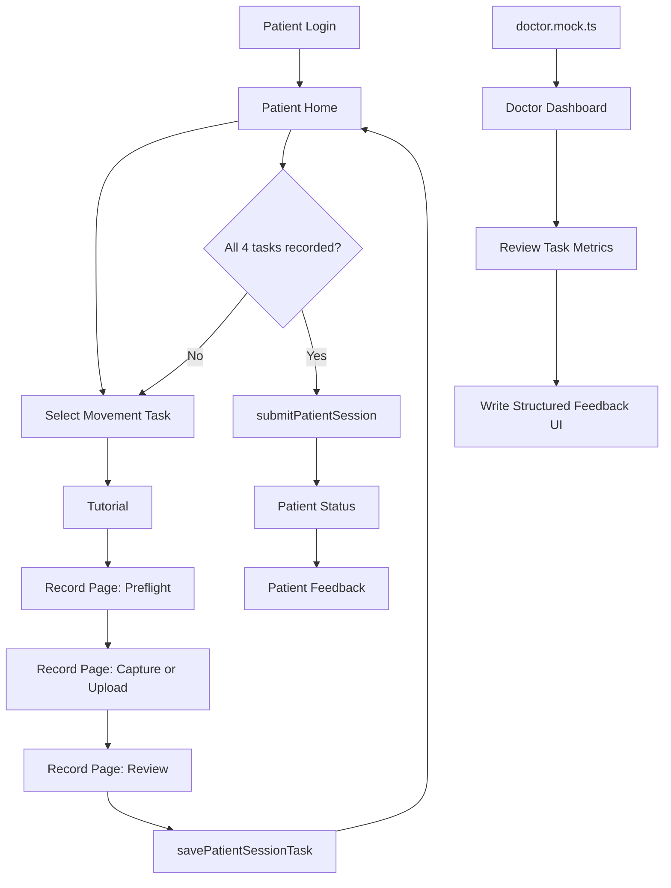

# Movement Analysis Subsystem: Project Flow For AI

## Project Summary

This project is a frontend prototype for a home-based markerless movement analysis and tele-rehabilitation workflow.

The main idea is:

1. A patient records or uploads movement videos from home.
2. The system stores each movement task in a draft assessment session.
3. After all required tasks are completed, the patient submits the session.
4. The system shows a mock processing flow for pose extraction and screening.
5. A doctor reviews movement quality, risk flags, event markers, charts, and writes feedback.
6. The patient reads the doctor feedback and exercise plan.

The current repository is mostly frontend-only. It uses mock data and in-memory mock APIs instead of a real backend, database, video storage, or machine learning pipeline.

## Tech Stack

- Vite
- React 18
- TypeScript
- React Router
- TanStack Query
- Tailwind CSS
- Recharts
- Lucide React icons

## Current Runtime Shape

The app starts from `src/main.tsx`, wraps the app with `AppProviders`, then renders routes from `src/app/router.tsx`.

Main routes:

| Route | Purpose |
| --- | --- |
| `/` | Redirects to `/patient/login` |
| `/patient/login` | Mock patient login |
| `/patient/home` | Patient home and current draft session |
| `/patient/tutorial` | Tutorial before recording a movement task |
| `/patient/record` | Camera setup, recording/upload, review, symptom report, save task |
| `/patient/status` | Mock session processing status |
| `/patient/feedback` | Patient-facing doctor feedback |
| `/doctor/dashboard` | Doctor review dashboard |

The `src/features/analysis` and `src/features/dashboard` folders contain older or standalone analysis UI code, but they are not currently connected in `src/app/router.tsx`.

## Main Concepts

### Patient

The prototype uses one demo patient:

```text
PATIENT-7712
```

Defined in:

```text
src/features/patient/data/patient.mock.ts
```

### Assessment Session

A patient session contains 4 required movement tasks. A session starts as a draft. Each task becomes recorded after the patient records or uploads a video and saves it.

Session statuses:

| Status | Meaning |
| --- | --- |
| `draft` | Some tasks are not finished yet |
| `ready_to_submit` | All 4 tasks are recorded |
| `waiting_doctor` | Submitted and waiting for doctor review |
| `feedback_ready` | Doctor feedback is available |

### Movement Tasks

Defined in:

```text
src/features/patient/data/movementTasks.ts
```

Current tasks:

| Task ID | Display Name | Purpose |
| --- | --- | --- |
| `gait_walk` | Gait Walk | Walk straight for gait observation |
| `sit_to_stand` | Sit to Stand | Stand up and sit down repeatedly |
| `single_leg_stance` | Single Leg Stance | Balance assessment |
| `shoulder_flexion` | Shoulder Flexion | Shoulder range and trunk compensation check |

Each task includes:

- label and short label
- required camera view
- camera distance instruction
- recording duration
- tutorial title/body
- optional safety note
- symptom questions for relevant body parts

## Patient Flow

### 1. Login

File:

```text
src/features/patient/pages/PatientLoginPage.tsx
```

The login page calls `mockLogin()` from `patientApi.ts`. It does not validate real credentials. On success, it navigates to:

```text
/patient/home
```

### 2. Patient Home

File:

```text
src/features/patient/pages/PatientHomePage.tsx
```

The home page loads:

- current draft session
- latest submitted session
- latest doctor feedback

Mock API functions:

```text
getPatientDraftSession()
getLatestPatientSession()
getLatestDoctorFeedback()
```

The page shows the 4 movement tasks. Selecting a task navigates to:

```text
/patient/tutorial?task=<task_id>
```

When all 4 tasks are recorded, the submit button becomes enabled. Pressing it calls:

```text
submitPatientSession()
```

Then the user is sent to:

```text
/patient/status
```

### 3. Tutorial

File:

```text
src/features/patient/pages/PatientTutorialPage.tsx
```

The tutorial page reads the selected task from the `task` query parameter.

Example:

```text
/patient/tutorial?task=gait_walk
```

It displays the tutorial text and task-specific camera instructions. The page simulates watching a tutorial video by enabling the next button after a short delay.

Next route:

```text
/patient/record?task=<task_id>
```

### 4. Record / Upload

File:

```text
src/features/patient/pages/PatientRecordPage.tsx
```

This is the most important patient workflow. It has 3 phases:

| Phase | Purpose |
| --- | --- |
| `preflight` | Open camera preview and confirm setup checklist |
| `capture` | Countdown, record webcam video, auto-stop after task duration |
| `review` | Preview video, upload/replace file, fill symptoms, save task |

#### Preflight Phase

The patient confirms:

- A4 reference is visible
- full body is visible
- camera distance is correct
- lighting is good
- safety note is accepted, if the task has one

The app tries to open the webcam with:

```text
navigator.mediaDevices.getUserMedia()
```

If the browser cannot open or record webcam video, the app moves to review mode and asks the user to upload a video instead.

#### Capture Phase

The page uses:

```text
MediaRecorder
```

It performs a countdown, records the video, auto-stops after `task.durationSeconds`, converts the recorded blob to a `File`, and moves to review.

#### Review Phase

The patient can:

- preview the recorded/uploaded video
- upload or replace a `.mp4`, `.mov`, or `.webm` file
- see video quality checks based on the preflight checklist
- answer symptom questions per body part
- add notes
- save this movement task into the draft session

Saving calls:

```text
savePatientSessionTask()
```

After saving, TanStack Query invalidates the draft session query and navigates back to:

```text
/patient/home
```

### 5. Submit Session

File:

```text
src/features/patient/api/patientApi.ts
```

When all 4 tasks are recorded, `submitPatientSession()` changes the draft into a submitted session with status:

```text
waiting_doctor
```

Then it resets the draft session for the next assessment.

Important limitation: this state is stored in browser runtime memory only. Refreshing the page may reset data.

### 6. Status Page

File:

```text
src/features/patient/pages/PatientStatusPage.tsx
```

The status page shows a mock pipeline:

1. Session submitted
2. MediaPipe Pose Extraction
3. Random Forest Screening
4. Doctor review

This page does not run real MediaPipe or Random Forest. It only displays status based on mock session state.

### 7. Feedback Page

File:

```text
src/features/patient/pages/PatientFeedbackPage.tsx
```

Loads feedback from:

```text
getLatestDoctorFeedback()
```

Displays:

- doctor name and date
- patient-friendly summary
- retake requests
- task-by-task feedback
- exercise plan
- follow-up plan
- warning symptoms to watch for

## Doctor Flow

### Doctor Dashboard

File:

```text
src/features/doctor/pages/DoctorDashboardPage.tsx
```

Mock data:

```text
src/features/doctor/data/doctor.mock.ts
```

The doctor dashboard lets a doctor:

1. Search/select a patient.
2. Select an assessment session.
3. Select a movement task.
4. View a skeleton/video placeholder.
5. Move through frame timeline markers.
6. Inspect event markers such as warning or critical frames.
7. Read risk level, confidence, quality score, flags, and recommended action.
8. View Recharts line graphs for movement metrics.
9. Write a clinical summary and patient-friendly summary.
10. Use UI buttons for exercise plan, retake task, and structured feedback.

Important limitation: the doctor dashboard currently uses separate mock data. It does not read submitted sessions from the patient mock API, and the send feedback button does not update patient state yet.

## Intended Full System Architecture

The project proposal describes a bigger 5-layer system:

| Layer | Purpose |
| --- | --- |
| L1 Sensing / Capture | Patient records video with smartphone/webcam |
| L2 Pose Estimation / QC | Backend extracts skeleton/keypoints and checks quality |
| L3 Feature Extraction | Backend calculates clinical movement features |
| L4 Analysis / Screening | Rule-based or lightweight ML flags risk and abnormality |
| L5 Application UI | Patient and doctor web interfaces |

Only L5 is mostly implemented in this repository right now. L1 is partially implemented in the browser through webcam recording/upload. L2-L4 are represented by mock data and UI placeholders.

## Important Data Flow For Future AI Work



## Key Files For AI Agents

| File | Why It Matters |
| --- | --- |
| `src/app/router.tsx` | Defines the currently active routes |
| `src/app/providers.tsx` | Sets up TanStack Query |
| `src/features/patient/api/patientApi.ts` | Patient mock API and in-memory session state |
| `src/features/patient/data/movementTasks.ts` | Movement task definitions |
| `src/features/patient/data/patient.mock.ts` | Demo patient, mock sessions, mock feedback |
| `src/features/patient/types/patient.types.ts` | Patient/session/feedback TypeScript types |
| `src/features/patient/pages/PatientHomePage.tsx` | Patient draft session overview and submit button |
| `src/features/patient/pages/PatientRecordPage.tsx` | Camera setup, recording, upload, review, symptom report |
| `src/features/patient/pages/PatientStatusPage.tsx` | Mock processing status |
| `src/features/patient/pages/PatientFeedbackPage.tsx` | Patient-facing feedback |
| `src/features/doctor/data/doctor.mock.ts` | Doctor dashboard mock analysis data |
| `src/features/doctor/pages/DoctorDashboardPage.tsx` | Doctor review UI |

## Current Limitations

- No real backend API.
- No persistent database.
- No real video upload service.
- No real MediaPipe or pose estimation pipeline.
- No real Random Forest or ML screening.
- Doctor dashboard does not consume patient-submitted mock sessions.
- Doctor feedback builder does not save feedback back to patient state.
- Some Thai text in existing files appears mojibake/encoding-corrupted.
- No automated test framework is configured.

## Suggested Next Steps

1. Fix Thai text encoding in source and mock data.
2. Connect doctor dashboard to submitted patient sessions.
3. Make structured feedback update patient-visible feedback.
4. Replace in-memory mock API with backend endpoints.
5. Add secure video upload flow, preferably signed URL based.
6. Add pose estimation and quality-control pipeline.
7. Add persistent session and feedback storage.
8. Add role-based authentication for patient and doctor.
9. Add tests for patient flow and doctor feedback flow.

